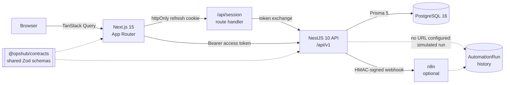

# Project Command Center (OpsHub)

[](https://github.com/MaximilianoPolicicchio/opshub/actions/workflows/ci.yml)
[](LICENSE)


An operations platform for a single product builder running several software
products, client engagements, and automation systems at the same time.

**Stack:** Next.js 15 · React 19 · NestJS 10 · PostgreSQL 16 · Prisma 5 · TypeScript
(strict) · pnpm workspaces · Playwright · GitHub Actions

```
pnpm install && pnpm db:migrate && pnpm db:seed   # then pnpm dev:api + pnpm dev:web
```

Sign in with `demo@opshub.local` / `DemoPassword123!`.

> **Screenshots:** not yet captured. See [Screenshots](#screenshots) for the
> shot list. Every figure in the seeded data is fabricated.

### Engineering highlights

Each of these is a decision with a trade-off behind it, not a checkbox:

- **Multi-tenant isolation that a test enforces.** Every mutation on a
  tenant-owned model carries `workspaceId` in its own `where`, so a cross-tenant
  id raises `P2025` instead of relying on a preceding ownership check that a
  refactor could drop. [`tenant-scoping.arch.spec.ts`](apps/api/src/prisma/tenant-scoping.arch.spec.ts)
  fails the build if anyone writes one without it.
- **Concurrency enforced by Postgres, not by hope.** One active timer per user
  is a partial unique index; overlapping time entries are blocked by a GiST
  exclusion constraint over `(userId, tstzrange)`. The application checks exist
  only to turn driver errors into readable messages.
- **Refresh-token rotation with reuse detection.** Tokens are stored hashed and
  rotate on every use; replaying a rotated token revokes the whole family. The
  access token never leaves memory, and the refresh token lives in an httpOnly
  cookie.
- **Business rules as pure functions.** Health evaluation, budget burn,
  recurrence maths, the actionable-task predicate and overlap detection live in
  dependency-free `*.logic.ts` files, unit-tested without a database. Money is
  `Decimal` throughout — never a float.
- **Idempotent automations.** Every webhook attempt — success, failure, or
  simulated when no URL is configured — writes an `AutomationRun`, and a
  `dedupeKey` stops the daily scan firing twice for the same entity.
- **CI that actually runs the product.** Migrations, seed, 76 unit tests, 49 API
  e2e tests against real Postgres, and a Playwright browser suite, on every push.
  The audit gate fails on any high advisory; there are currently none.

### Documentation

| | |
| --- | --- |
| [docs/architecture.md](docs/architecture.md) | Module boundaries, request path, data model |
| [docs/business-rules.md](docs/business-rules.md) | Exact predicates and formulas |
| [docs/costs.md](docs/costs.md) | Operating costs: model, monthly rules, ingestion design |
| [docs/automations.md](docs/automations.md) | Webhook contract and signature verification |
| [docs/security.md](docs/security.md) | Threat model and isolation detail |
| [docs/deployment.md](docs/deployment.md) | Env vars, migrations, rollback |
| [docs/adr/](docs/adr/) | Eight decision records — what was rejected, and why |

### Architecture at a glance



It exists to answer, in a few seconds:

- What should I work on today?
- Which project needs attention, and why?
- What is blocked, and what is it blocked on?
- How much time went into each project this week or month?
- Am I over the estimated effort or over budget?
- Which automation needs review?
- Can I set up a new project in under two minutes?

This is not a to-do app. Tasks are the smallest unit, but the product is built
around **projects, time, budget burn, and automation health** — the things that
actually decide where a solo operator's next hour should go.

---

## The problem it solves

Running four or more products at once, the failure mode is not forgetting a
task. It is losing the thread: a client project quietly drifts past its budget,
a high-priority task sits blocked for two weeks, an automation fails silently,
and nothing surfaces it until it becomes expensive.

OpsHub makes those signals structural rather than something you have to
remember to check:

- **Project health is computed, not self-reported.** A project turns
  `NEEDS_ATTENTION` or `BLOCKED` automatically from overdue high-priority work,
  blocked dependencies, budget burn, or inactivity — with a stored reason.
- **Budget burn is derived from tracked time**, not typed in. Alerts fire once
  per threshold and are recorded permanently.
- **Blocked work cannot be quietly closed.** A task with an unfinished
  prerequisite is rejected on the way to `Done`, at the API level.
- **Today only shows actionable work.** Blocked, waiting, and paused-project
  tasks are deliberately excluded from the actionable list.

---

## Main workflows

**Morning triage.** Open **Today**. Actionable tasks are grouped overdue → due
today → in progress → next up, with blocked items and a collapsed "waiting on"
section separate. Start a timer straight from a task.

**Tracking work.** One timer runs at a time, enforced by a partial unique index
in Postgres. Stop it with a short description, or add time manually. Overlapping
entries for the same user are impossible — the database rejects them.

**Watching costs.** **Costs** records vendors, recurring subscriptions and real
expenses, then closes the month: expected versus actual per project, per vendor
and per currency, with price rises flagged and unreviewed imports held out of
the totals. Entry is manual — **no mailbox is connected**, by design
([ADR 0008](docs/adr/0008-costs-manual-first.md)).

**Watching money.** **Financial Overview** shows budget vs tracked value and
estimated vs actual hours for every project, grouped by currency, with projects
near their limits highlighted. Internal projects track hours without a financial
budget.

**Starting something new.** The **New Project** wizard is five short steps and
ends in one atomic request: name and type → status, priority, tags → optional
repo/deploy/docs links → time and budget → template. Templates seed useful
starter tasks.

**Weekly close.** **Weekly Review** assembles completed work, carryover, blocked
items, time by project, projects at risk, and what is due next week.

---

## Architecture

pnpm workspace monorepo, no Docker required for local development.

```
OpsHub/
├─ apps/
│  ├─ api/            NestJS 10 + Prisma + PostgreSQL   (81 source files)
│  │  ├─ prisma/      schema, migrations, seed
│  │  └─ src/
│  │     ├─ common/   guards, decorators, pipes, filters, interceptors
│  │     ├─ config/   Zod-validated environment
│  │     ├─ prisma/   client + tenant-scoping architectural test
│  │     └─ modules/  auth, users, workspaces, projects, tasks, milestones,
│  │                  notes, time-entries, budgets, automations, activity,
│  │                  weekly-review, scheduler, system
│  └─ web/            Next.js 15 App Router + React 19 + TypeScript + Tailwind
└─ packages/
   └─ contracts/      Zod schemas + enums shared by web and api
```

Two deliberate structural choices:

**Pure logic is separated from persistence.** Every non-trivial business rule
lives in a dependency-free `*.logic.ts` module — health evaluation, budget
calculation, recurrence date math, the actionable-task predicate, overlap
detection, dependency-cycle detection. Prisma-backed services wrap them. This is
why the rules are unit-testable without a database.

**Tenancy is enforced explicitly, and a test proves it.** Every tenant-owned row
carries a denormalized `workspaceId`, and every query filters on it in the
service that owns the model — there is no magic interceptor doing it behind your
back.

Reads use `findFirst({ id, workspaceId })`, never `findUnique({ id })`, so an id
from another workspace returns 404 rather than 403: no existence disclosure.

Writes are the part that usually goes wrong. Checking ownership and then
mutating by id alone is a TOCTOU pattern — two statements, where the mutation
would cross a tenant boundary the moment the check is refactored away. Prisma 5
accepts extra non-unique filters alongside a unique field, so every `update` and
`delete` carries `where: { id, workspaceId }` and is authoritative on its own; a
foreign id raises `P2025` instead of quietly succeeding.

Because a missing property in a `where` clause is exactly the kind of thing code
review misses, [`tenant-scoping.arch.spec.ts`](apps/api/src/prisma/tenant-scoping.arch.spec.ts)
fails the build if any mutation on a tenant-owned model is written without it.

### Data model

18 models, 14 enums: `Workspace`, `User`, `Role`, `Membership`, `RefreshToken`,
`Project`, `ProjectTemplate`, `Milestone`, `Task`, `TaskDependency`, `TaskLink`,
`Note`, `TimeEntry`, `ProjectBudget`, `BudgetAlert`, `Automation`,
`AutomationRun`, `ActivityEvent`.

Full field-level detail and the reasoning behind each mechanism is in
[`PROJECT_PLAN.md`](./PROJECT_PLAN.md).

---

## Stack

| Layer | Choice |
| --- | --- |
| Package manager | pnpm workspaces, Node 20+ |
| Web | Next.js 15 (App Router), React 19, TypeScript, Tailwind, TanStack Query |
| API | NestJS 10, TypeScript strict |
| Database | PostgreSQL 16/17 + Prisma |
| Auth | JWT access + rotating opaque refresh tokens, bcrypt |
| Validation | Zod (shared contracts) + Nest pipes |
| Scheduling | `@nestjs/schedule`, in-process |
| CI | GitHub Actions |
| Integration | Optional outbound n8n webhook, env-configured |

---

## Run it with Docker

Docker is optional — the native setup below needs no containers. If you do want
the whole stack in one command:

```bash
cp .env.docker.example .env.docker
docker compose up --build
```

Postgres, the API and the web app come up together; `btree_gist` is created and
migrations are applied by a one-shot `migrate` service before the API starts.
Then open http://localhost:3000.

```bash
pnpm docker:seed    # load the fabricated demo workspace
```

```bash
pnpm docker:reset   # stop everything and drop the data volume
```

> **Validated end to end** on 2026-07-29 — built, started, signed in through the
> browser, read and wrote against the containers. Getting there took five real
> defects that CI could not see, because CI builds and tests but never runs a
> container. They are written up in
> [docs/docker-handoff.md](docs/docker-handoff.md).

## Local setup

**Prerequisites:** Node 20+, pnpm 9+, and a PostgreSQL 16 or 17 server. No
Docker needed.

```bash
pnpm install
```

Create the database and the extension the overlap constraint depends on:

```bash
createdb opshub
psql -d opshub -c "CREATE EXTENSION IF NOT EXISTS btree_gist;"
```

Copy the environment template and fill in `DATABASE_URL` and the two JWT
secrets:

```bash
cp .env.example .env
```

Migrate and seed:

```bash
pnpm --filter @opshub/api db:migrate:deploy
pnpm --filter @opshub/api db:seed
```

Run both apps (separate terminals):

```bash
pnpm dev:api
```

```bash
pnpm dev:web
```

API on `http://localhost:4000/api/v1`, web on `http://localhost:3000`.

To wipe and rebuild the demo data at any point:

```bash
pnpm --filter @opshub/api db:reset
```

### Environment variables

| Variable | Required | Purpose |
| --- | --- | --- |
| `DATABASE_URL` | yes | PostgreSQL connection string |
| `JWT_ACCESS_SECRET` | yes | Access token signing key, min 32 chars |
| `JWT_REFRESH_SECRET` | yes | Refresh token signing key, min 32 chars |
| `ACCESS_TOKEN_TTL` | no | Default `15m` |
| `REFRESH_TOKEN_TTL` | no | Default `30d` |
| `N8N_WEBHOOK_URL` | no | Absent ⇒ automations run in simulated mode |
| `N8N_WEBHOOK_SECRET` | no | Enables HMAC-SHA256 request signing |
| `N8N_WEBHOOK_TIMEOUT_MS` | no | Default `5000` |
| `SCHEDULER_ENABLED` | no | Set `false` in CI and secondary instances |
| `WEB_ORIGIN` | no | CORS origin, default `http://localhost:3000` |
| `API_PORT` | no | Default `4000` |
| `SEED_PASSWORD` | no | Demo user password, development only |
| `NEXT_PUBLIC_API_URL` | no | Default `http://localhost:4000/api/v1` |

The API validates its environment at boot with Zod and refuses to start on a
missing or weak secret.

### Demo account

```
email:    demo@opshub.local
password: DemoPassword123!
```

Seeded workspace **Demo Ops** contains four demo projects — Hernan Shop, Maxus
Dental, Maxus Market, Consultorio PYM Automations — with tasks across every
status, ~210 hours of non-overlapping time entries, budgets, fired alerts,
automations with run history, milestones, notes, and activity.

> All seeded content is fabricated. There is no real customer, financial,
> patient, or credential data anywhere in this repository. The seed script
> refuses to run when `NODE_ENV=production` unless `ALLOW_PROD_SEED=true`.

---

## Tests

```bash
pnpm --filter @opshub/api test
```

```bash
pnpm --filter @opshub/api test:e2e
```

```bash
pnpm -r typecheck
```

```bash
pnpm -r lint
```

```bash
pnpm -r build
```

**Unit tests (54)** cover the pure business logic with no database: budget
calculator, project health evaluator, recurrence date math, actionable-task
predicate, overlap detection, dependency-cycle detection.

**E2E tests (11)** run against a real PostgreSQL instance via supertest and
cover the security- and correctness-critical paths: the full auth flow with
refresh rotation, workspace isolation (one user cannot read another's project
and it 404s rather than 403s), timer conflict behaviour, and dependency gating.

`test:e2e` needs a migrated database — run the migrate and seed steps first.

---

## CI

`.github/workflows/ci.yml` runs on every push to `main` and every pull request,
against a `postgres:16` service container:

install (frozen lockfile, cached) → `prisma validate` → `prisma generate` →
typecheck both apps → lint → `prisma migrate deploy` → API unit tests → seed →
API e2e tests → build API → build web.

Any failing step fails the build. `SCHEDULER_ENABLED=false` in CI so cron jobs
do not fire during tests.

---

## n8n webhook contract

A real n8n instance is **not** required. If `N8N_WEBHOOK_URL` is unset,
automations execute in simulated mode: the full payload is built and recorded,
nothing is sent, and the result is visible in the UI.

Events are emitted when a high-priority task becomes overdue, a project's health
changes, a budget threshold is reached, and a weekly review is generated.

`POST` with `Content-Type: application/json`, plus
`X-OpsHub-Signature: sha256=<hmac(secret, rawBody)>` when `N8N_WEBHOOK_SECRET`
is set:

```jsonc
{
  "eventType": "budget.threshold.reached",
  "eventId": "clx...",              // == AutomationRun.id, for consumer idempotency
  "occurredAt": "2026-07-25T14:03:11.442Z",
  "workspace": { "id": "clx...", "name": "Demo Ops", "slug": "demo-ops" },
  "project":   { "id": "clx...", "name": "Hernan Shop", "type": "CLIENT_PRODUCT",
                 "status": "ACTIVE", "health": "NEEDS_ATTENTION" },
  "automation": { "id": "clx...", "name": "Budget threshold alert",
                  "trigger": "BUDGET_THRESHOLD_REACHED" },
  "simulated": false,
  "payload": { }
}
```

| `eventType` | `payload` |
| --- | --- |
| `task.overdue.high_priority` | `taskId, title, priority, category, status, dueDate, daysOverdue` |
| `project.health.changed` | `from, to, reason, openHighPriorityCount, overdueCount` |
| `budget.threshold.reached` | `budgetId, threshold, burnPercent, trackedValue, budgetAmount, currency, remainingAmount, billingModel` |
| `weekly_review.generated` | `periodStart, periodEnd, tasksCompleted, hoursTracked, billableHours, projectsAtRisk[], upcomingDue[]` |

**Every attempt is recorded as an `AutomationRun`**, so there is always a
history even when nothing was sent:

| Situation | Status | `simulated` |
| --- | --- | --- |
| 2xx response | `SUCCESS` | false |
| non-2xx, timeout, or network error after retries | `FAILED` | false |
| `N8N_WEBHOOK_URL` unset | `SIMULATED` | true |
| "Simulate run" pressed in the UI | `SIMULATED` | true |
| automation disabled or filtered out by config | `SKIPPED` | false |

Retries: 2 attempts with 1s then 4s backoff, on network errors and 5xx only.
Automatically-triggered runs carry a `dedupeKey` of
`"<TRIGGER>:<entityId>:<YYYY-MM-DD>"` under a unique index, so a daily scan
cannot fire twice for the same entity on the same day. Manual runs leave it null
and are unlimited.

---

## Time-tracking rules

- **One active timer per user**, enforced by a partial unique index
  (`WHERE "endTime" IS NULL`) plus a transactional check. Starting a second
  timer returns `409 TIMER_ALREADY_RUNNING` with the running entry attached;
  resending with `onConflict: "stopPrevious"` stops the old one and starts the
  new one.
- **No overlapping entries** for the same user. The authority is a PostgreSQL
  exclusion constraint:
  `EXCLUDE USING gist ("userId" WITH =, tstzrange("startTime","endTime",'[)') WITH &&)`.
  Half-open bounds mean back-to-back entries (10:00–11:00 then 11:00–12:00) are
  valid, while any true overlap returns `422 TIME_ENTRY_OVERLAP` naming the
  conflicting entry.
- **No negative or inconsistent durations**, enforced by `CHECK` constraints.
- `durationMinutes` is always computed server-side from start and end; clients
  never supply it.

## Budget rules

Scoped to the project and, when set, the budget's date window.

```
trackedHours   = sum(durationMinutes) / 60
billableHours  = sum(durationMinutes where billable) / 60

HOURLY:       trackedValue = billableHours * hourlyRate
FIXED_PRICE:  trackedValue = billableHours * (budgetAmount / estimatedHours)
INTERNAL:     trackedValue = trackedHours  * (hourlyRate ?? 0)   // cost view only

valueBurnPercent = budgetAmount   > 0 ? trackedValue / budgetAmount   * 100 : null
hoursBurnPercent = estimatedHours > 0 ? trackedHours / estimatedHours * 100 : null
burnPercent      = valueBurnPercent ?? hoursBurnPercent ?? 0

remainingAmount = budgetAmount   - trackedValue   // may go negative
remainingHours  = estimatedHours - trackedHours   // may go negative
```

All money is `Decimal(12,2)` computed with `decimal.js` — never JS floats.
Currency is stored per budget and never converted; the Financial Overview groups
totals by currency.

**Alerts fire once per threshold, permanently.** `BudgetAlert` carries
`@@unique([projectBudgetId, threshold])`, and evaluation uses
`createMany({ skipDuplicates: true })` — that index *is* the dedupe. Crossing 50%
and 75% in a single entry fires both, once each, in ascending order. Deleting
time later does not un-fire an alert: thresholds are historical facts. Only
editing `budgetAmount`, `hourlyRate`, or `estimatedHours` prunes alerts above the
new burn so they can fire again meaningfully. `INTERNAL` budgets never fire
alerts and are excluded from revenue totals.

## Project health rule

Evaluated after relevant task changes and nightly. First match wins:

```
BLOCKED          ≥1 high-priority open task blocked by an unfinished dependency
                 or ≥1 high-priority task WAITING for more than 7 days
NEEDS_ATTENTION  ≥1 high-priority task overdue
                 or ≥3 open tasks overdue
                 or budget burn ≥ 90%
                 or no activity for 14 days (ACTIVE projects only)
HEALTHY          otherwise
```

`PAUSED` and `ARCHIVED` projects short-circuit to `HEALTHY` — parked is not
unhealthy. Every evaluation stores a human-readable `healthReason`, and a change
writes an `ActivityEvent` and emits the health webhook.

---

## Screenshots

<!-- Replace these placeholders with real captures. -->

| View | Screenshot |
| --- | --- |
| Today | `docs/screenshots/today.png` |
| Projects | `docs/screenshots/projects.png` |
| Project detail — Kanban | `docs/screenshots/project-board.png` |
| Project detail — Budget | `docs/screenshots/project-budget.png` |
| Time and reports | `docs/screenshots/time.png` |
| Financial Overview | `docs/screenshots/financial.png` |
| Automations | `docs/screenshots/automations.png` |
| Weekly Review | `docs/screenshots/weekly-review.png` |

---

## Technical decisions

**Interval recurrence instead of RRULE.** A solo operator's recurring work is
"every week", not "the third Tuesday". Recurrence is interval + unit + anchor.
The next occurrence is created *only* when the current one is completed, so a
series never piles up twelve missed occurrences. Idempotency comes from
`@@unique([recurrenceSeriesId, occurrenceIndex])`.

**Overlap prevention in the database, not just the service.** An application
check alone loses to a concurrent request. The exclusion constraint is the
authority; the service pre-check exists purely to return a readable 422 instead
of a driver error.

**`isBlocked` is a cache, never the guard.** It is denormalized for fast list
sorting, but the write guard that refuses `Done` always re-queries prerequisites
inside the transaction with row locks. A nightly job repairs any drift.

**Health is stored, not computed on read.** It needs to be filterable and
indexable, and a stored value is what makes "health *changed*" a detectable
event worth emitting.

**Roles are read per request, not carried in the JWT.** A permission change
takes effect immediately rather than at next token refresh.

**Refresh tokens are opaque, hashed at rest, and rotated on every use.** Reusing
a revoked token revokes the whole family and forces re-login.

**No Redis, no job queue.** One in-process `@nestjs/schedule` cron, gated by
`SCHEDULER_ENABLED`. A missed webhook is acceptable; `AutomationRun` always
records the attempt and supports manual retry. This is the seam to replace first
if the workload ever justifies it.

**One shared package only.** `packages/contracts` holds Zod schemas and enums.
No shared UI or utility package — premature for a two-app repo.

---

## Limitations

Honest scope boundaries for v1:

- **Single user in practice.** Workspace, Membership, and Role are fully modeled
  and enforced end to end, but there is no invitation flow or collaborator UI.
- **Outbound webhooks only.** Nothing calls back into OpsHub from n8n.
- **At-most-once webhook delivery.** Two retries, no durable queue. A webhook can
  be lost; the `AutomationRun` record will show it.
- **Timezone handling is simplified.** Timestamps are stored as UTC and time
  entries as `timestamptz`, but recurrence and health date math use UTC calendar
  arithmetic rather than full IANA workspace-timezone conversion. This can shift
  a boundary by a day for users far from UTC.
- **No password reset email, OAuth, SSO, or 2FA.** Password change while logged
  in only.
- **One budget per project**, no invoicing, no expenses, no currency conversion.
- **Dependencies are same-project and single-level for gating.** Cross-project
  dependencies are rejected with a 422.
- **No sub-tasks**, no custom fields, custom statuses, or custom roles.
- **No file attachments.**
- **No real-time updates.** Data refreshes on navigation and query invalidation,
  not WebSockets.
- **Browser coverage is a starting set.** Six Playwright specs cover the shell,
  project creation, weekly review, financial overview and sign-out. Flows that
  need more fixture setup — dependency gating in the UI, the timer, budget burn
  updating live, simulating an automation — are still only covered by the API
  e2e suite.
- **Docker is validated locally, not on a clean machine.** The stack builds and
  runs (see [docs/docker-handoff.md](docs/docker-handoff.md)), but every run so
  far used a warm build cache and an existing volume. Compose is a development
  convenience, not a deployment: no resource limits, no secrets management, and
  `SCHEDULER_ENABLED` defaults to true, which is wrong for more than one API
  replica.
- **Financial Overview does not yet surface budget alerts** or an estimated-vs-
  actual hours column; both live on the per-project Budget tab. The
  cross-project rollup shows budget, tracked value, remaining, billable hours,
  and burn.
- **Soft delete without a restore UI.** `archivedAt` exists on Project, Task, and
  Automation, but v1 only archives.
- **No Postgres row-level security.** Isolation is enforced in the application
  layer: every query filters on `workspaceId`, every mutation is scoped in its
  own `where`, and an architectural test fails the build if a write is written
  without it. That is defence in the code, not in the database — a raw SQL
  console or a future service that bypasses these helpers is not covered. RLS is
  the natural next hardening step.
