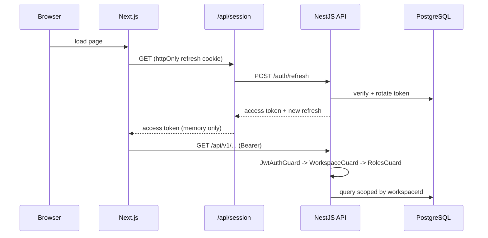

# Architecture

pnpm workspace monorepo. Docker is optional for local development.

```
OpsHub/
├─ apps/
│  ├─ api/            NestJS 10 + Prisma 5 + PostgreSQL 16
│  └─ web/            Next.js 15 App Router + React + Tailwind
└─ packages/
   └─ contracts/      Zod schemas + enums shared by both apps
```

`@opshub/contracts` compiles to JavaScript and both apps import its output, so
**build order matters**: contracts first. `pnpm build` does this; so do CI and
both Dockerfiles.

## Request path



The access token never leaves memory; the refresh token never leaves the httpOnly
cookie. See [ADR 0004](adr/0004-refresh-token-rotation.md) — in particular why
every refresh must go through a single-flight promise.

## Two structural choices

**Pure logic is separated from persistence.** Health evaluation, budget
calculation, recurrence maths, the actionable-task predicate, overlap detection
and dependency-cycle detection each live in a dependency-free `*.logic.ts`.
Services wrap them with Prisma. This is why 55 unit tests run in ~2 seconds with
no database, and why the rules can be reasoned about without reading query code.

**Tenancy is explicit and test-enforced.** No interceptor injects filters behind
your back. Every query filters on `workspaceId`, every mutation carries it in its
own `where`, and an architectural test fails the build otherwise. See
[ADR 0001](adr/0001-explicit-tenant-scoping.md).

## API modules

```
src/
├─ common/     guards (jwt, workspace, roles, throttler), decorators,
│              Zod pipe, Prisma exception filter, interceptors
├─ config/     Zod-validated environment; refuses to boot on weak secrets
├─ prisma/     client + tenant-scoping architectural test
└─ modules/    auth, users, workspaces, projects, tasks, milestones, notes,
               time-entries, budgets, automations, activity, weekly-review,
               scheduler, system
```

Boundaries that are enforced, not just documented:

- `activity` and the webhook dispatcher are **leaf** services. Everything imports
  them; they import nothing back. That is what keeps the dependency graph acyclic.
- `project-health` is owned by `projects` and called by `tasks` through an
  injected interface, so tasks does not reach into projects' tables.
- Cross-module writes always go through the owning service, never a foreign
  Prisma call, so transactions and activity events stay consistent.

## Guard chain

1. **JwtAuthGuard** — validates the access token, loads the user. Bypassed by
   `@Public()`.
2. **WorkspaceGuard** — resolves the workspace from the `X-Workspace-Id` header,
   a route param, or the user's single membership; loads membership and role.
   No membership means 403. **`workspaceId` is never read from a request body.**
3. **RolesGuard** — checks `@Roles` / permission metadata. No decorator means any
   member.

## Data model

17 entities. Tenant-owned rows — Project, ProjectTemplate, Milestone, Task,
TaskDependency, TaskLink, Note, TimeEntry, ProjectBudget, BudgetAlert,
Automation, AutomationRun, ActivityEvent — all carry a denormalised
`workspaceId` so composite `(workspaceId, ...)` indexes work on every hot query.

Workspace, User, Membership and Role exist and are enforced end to end even
though v1 has a single user. The collaborator model is present in the schema;
only the invite UI is deferred.

Conventions: cuid ids · `Decimal` money · integer minutes · `archivedAt` soft
delete on Project, Task and Automation only.

## Web app

App Router with a `(app)` shell — sidebar, workspace switcher, live timer widget
— wrapping Today, Projects, Project Detail (ten tabs), Time, Financial Overview,
Automations, Weekly Review and Settings.

TanStack Query against the API from client components; server components only for
the shell and static pages. Tailwind with a small local primitive set — no
component library.

**A trap worth knowing:** some list endpoints return `{ rows, total, page,
pageSize }` and others a bare array. Treating a paginated response as an array
silently renders nothing, or throws when `.filter` is called on it. Four hooks
had this bug. Check the endpoint's shape before writing the hook.

## Scheduling

One in-process `@nestjs/schedule` cron, gated by `SCHEDULER_ENABLED` (off in CI
and tests, where it would otherwise race assertions):

- every 15 min — scan for newly overdue high-priority tasks
- nightly — recompute blocked flags, project health, budget burn and alerts
- weekly — generate the weekly review

No Redis, no worker process. This is the seam to pull if it ever needs to scale.
