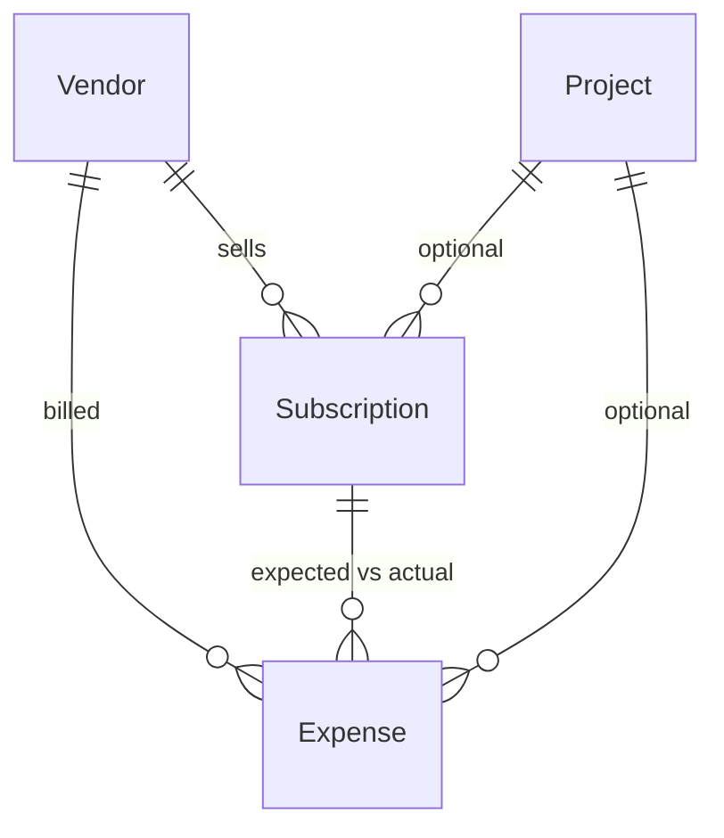

# Operating costs

The spending side of the money picture. `ProjectBudget` answers *"how much of
what I am charging have I burned"*; this module answers *"what am I paying, per
project, per month"*.

> **No mailbox is connected.** Expenses are entered by hand. A signed ingestion
> endpoint for a dedicated billing address is designed below but **not
> implemented** — see [ADR 0008](adr/0008-costs-manual-first.md).

## Model

Three entities, all tenant-owned and carrying a denormalised `workspaceId` like
every other row in the system.



**Vendor** — a supplier, one row per real company. `normalizedName` (lowercased,
trimmed, collapsed whitespace) is unique per workspace, so `Vercel`, `vercel `
and `VERCEL` cannot become three suppliers. That identity is what makes "which
subscriptions went up" answerable, and what a future import would match against.

**Subscription** — a standing, recurring cost: vendor, optional project, name,
`expectedAmount`, currency, `MONTHLY` or `YEARLY`, category, active flag,
optional next charge date. This is the **expected** side.

**Expense** — a real charge: vendor, optional subscription, optional project,
amount, currency, date, billed period, status, source, optional external
reference, notes. This is the **actual** side.

### Why `projectId` is optional

Shared infrastructure is genuinely not attributable to one project. A database
that serves three products is not one third each in any meaningful sense, and
forcing a choice would manufacture precision that is not there. Unassigned costs
are reported as their own line rather than hidden or spread.

### Why expected and actual are separate tables

A subscription is intent; an expense is what the card was charged. Keeping them
apart is what makes the whole expected-vs-actual comparison possible, and it is
what surfaces a price rise: the subscription still says 20, the expenses say 25.

## Status and source

`ExpenseStatus`: `PENDING_REVIEW` · `CONFIRMED` · `REJECTED` · `PAID`.

`ExpenseSource`: `MANUAL` · `N8N_IMPORT` · `FORWARDED_EMAIL`.

Anything that did not come from a human typing it lands in `PENDING_REVIEW`, so
no external system can move the monthly total on its own. `REJECTED` rows are
kept, not deleted — a rejected charge is evidence, and deleting it means the
same import creates it again.

## Monthly rules

- A month is bounded by the workspace timezone, consistent with the rest of the
  product.
- **Expected** for a month = active subscriptions, monthly ones at full amount,
  yearly ones only in their charge month. Yearly costs are *not* divided by
  twelve: this reports cash out, not accrual. That is a deliberate choice and
  the reason is that a solo operator cares when money actually leaves.
- **Actual** = expenses dated in that month with status `CONFIRMED` or `PAID`.
  `PENDING_REVIEW` is excluded from totals and surfaced as its own count, so an
  unreviewed import cannot quietly change the close.
- **Difference** = actual − expected. Positive means overspend.
- Every total is grouped by currency and never converted, matching Financial
  Overview.
- A **price increase** is an expense whose amount exceeds its subscription's
  `expectedAmount` by more than a small tolerance. Flagged, not auto-applied —
  the subscription is only updated when a human confirms it.

All of this is computed in a dependency-free `*.logic.ts` module and unit-tested
without a database, following the same pattern as budget burn and project
health.

## Monthly flow

1. Enter expenses as invoices arrive, or review what an importer left queued.
2. Work the **review queue**: confirm or reject.
3. Open the monthly summary: expected vs actual, per project, per vendor, per
   currency.
4. Investigate the differences — a missing expected charge, an unexpected new
   vendor, or a subscription that went up.
5. Update subscription amounts where a price rise is confirmed.

## Future: ingestion from a billing address

**Not implemented.** This is the design, so it can be built without redesigning.

The safe shape is a **dedicated billing address** — `billing@…`, or invoices
forwarded there by hand — never a personal mailbox and never Gmail OAuth. n8n
watches that address, extracts the few fields below, and POSTs them.

```
POST /api/v1/costs/ingest
X-OpsHub-Cost-Signature: sha256=<hmac of the raw body, COST_INGESTION_SECRET>
```

```jsonc
{
  "source": "N8N_IMPORT",
  "externalMessageId": "n8n-msg-1a2b3c",   // idempotency key
  "vendorName": "Vercel",
  "amount": "20.00",
  "currency": "USD",
  "date": "2026-07-04",
  "periodStart": "2026-07-01",             // optional
  "periodEnd": "2026-07-31",               // optional
  "notes": "Pro plan"                      // optional, short
}
```

Requirements, none of them optional:

- **HMAC-SHA256 over the raw body**, constant-time comparison, before parsing.
- **Zod validation** at the boundary like every other endpoint.
- **Idempotency** on `(workspaceId, source, externalMessageId)`, unique in the
  database rather than checked in application code.
- Always created as `PENDING_REVIEW`. Ingestion may never produce a confirmed
  expense.
- **No email body, no attachments, no headers.** Only the fields above. An
  invoice PDF is not needed to know that 20 USD went to Vercel.
- Vendor matched by `normalizedName`, created if absent.
- Rate limited, like every other public-facing endpoint.

## Deliberately not built

- **Percentage allocation across projects.** Needs a real rule — by revenue, by
  tracked hours, fixed weights — and picking one now would be a guess. The
  unassigned bucket is the honest interim answer.
- **Currency conversion.** Same position as budgets: store, group, never
  convert.
- **Payment automation.** This module records what was spent. It does not pay.
- **Accrual accounting.** Yearly costs land in their charge month.
